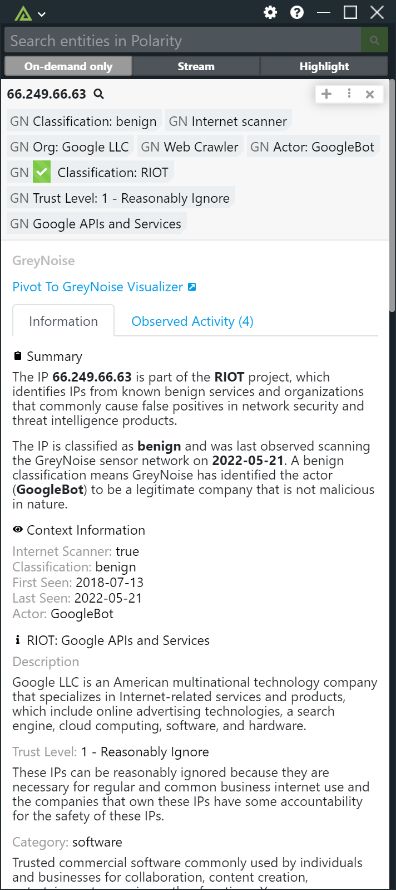
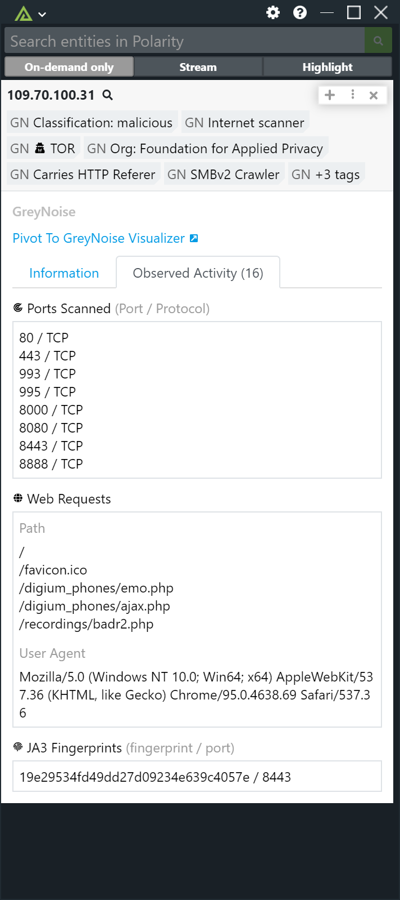

# Polarity GreyNoise Integration
The Polarity - GreyNoise integration searches IPs in GreyNoise for internet scan and attack activity related to indicators on your screen.  The scan and attack activity is then displayed via the Polarity Overlay Window, and we support the GreyNoise Community API out of the box if you do not already have an Enterpise API Key.

Sign up for a free GreyNoise Community API key here https://viz.greynoise.io/signup

|  ||
|---|---|--|
|*RIOT IP Address* |*Internet Scanner IP*| *Observed Activity*|

To learn more about GreyNoise, please visit the [official website](https://greynoise.io).

## GreyNoise Integration Options

### GreyNoise API Url
The base URL to the GreyNoise API you wish to use. Defaults to "https://api.greynoise.io".

### API Key
Account API key used to access GreyNoise API.

### Search using the Subscription API

If checked, the integration will search using the GreyNoise Subscription Based APIs. When unchecked, the GreyNoise Community API will be used (only supports IP lookups)

### Ignore IPs that have not been seen

If checked, IPs that have not been seen by GreyNoise will not be displayed in the Polarity Overlay window.

## Installation Instructions

Installation instructions for integrations are provided on the [PolarityIO GitHub Page](https://polarityio.github.io/).

## Polarity

Polarity is a memory-augmentation platform that improves and accelerates analyst decision making.  For more information about the Polarity platform please see:

https://polarity.io/
