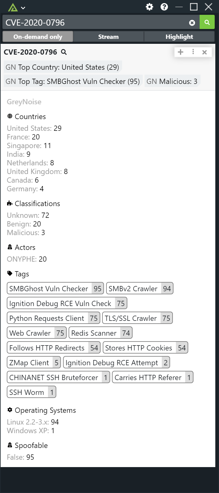

# Polarity GreyNoise Integration
The Polarity - GreyNoise integration searches IPs in GreyNoise for internet scan and attack activity related to indicators on your screen.  The scan and attack activity is then displayed via the Polarity Overlay Window, and we support the GreyNoise Community API out of the box if you do not already have an Enterpise API Key.

## IP Address Resuts

  

## CVE Results

  
  

To learn more about GreyNoise, please visit the [official website](https://greynoise.io).

## GreyNoise Integration Options

### GreyNoise Enterprise Url
The URL path to the Enterprise GreyNoise API you wish to use

### GreyNoise Api Key
Accounts api key used to access GreyNoise Api. If no API Key is entered, we will default to using the GreyNoise Community API to search.

### Ignore IPs that have not been seen
If set to true, IPs that have not been seen by Greynoise will not be displayed in the Polarity Overlay window.

### Ignore RFC1918 IPs 
Prevents RFC1918 IP addresses from being sent to the GreyNoise API for enrichment.

## Installation Instructions

Installation instructions for integrations are provided on the [PolarityIO GitHub Page](https://polarityio.github.io/).

## Polarity

Polarity is a memory-augmentation platform that improves and accelerates analyst decision making.  For more information about the Polarity platform please see:

https://polarity.io/
